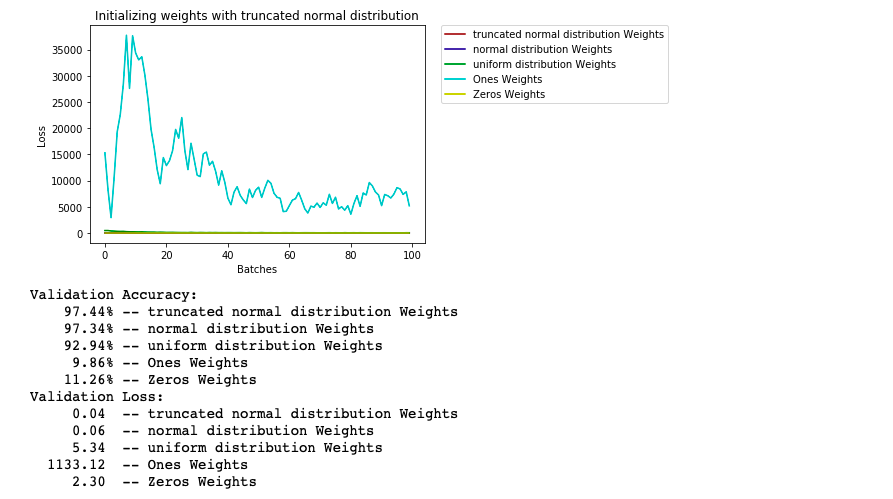

# Comparing Different Weight Initialization
### Introduction
In here we will learn how to initialize our neural network's weight in a way that it will boost the performance of our model. In this lesson we will initialize the network with the following options:
1. Initializing all with 0
2. Initializing all with 1
3. Initializing with uniform distribution
4. Initializing with normal distribution
5. Initializing with truncated normal distribution

### Result
Below you can see that it is important to initialize our weight correctly, Otherwise the accuracy of our model can decrease enormously.

